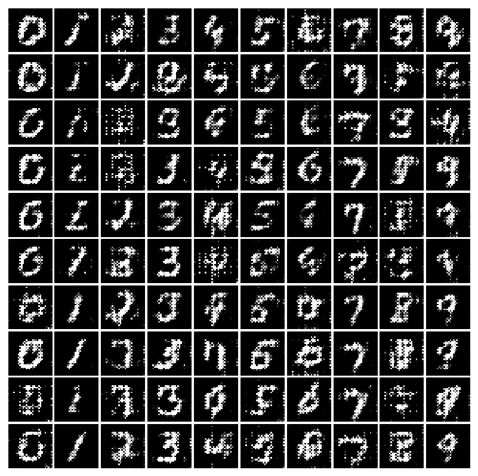

# ConditionalGAN-TensorFlow
An implementation of CGAN using TensorFlow. 
(still in progress, need to gather some actual interesting image data) 
## Computation Graph

Test Done:
Generate 28x28 fake MNIST images.
Using GTX970M, it took about 5mins to finish 4000 steps

## 0 step

## 200 steps

## 1500 steps

## 2000 steps

## 3000 steps

## 4000 steps

